# BankSimple — Documentation d'Architecture (Arc42)

---

| | |
|---|---|
| **Étudiant** | Jad Bizri |
| **Code permanent** | BIZJ81330201 |
| **Cours** | GTI611 — Architecture logicielle |
| **Projet** | Phase 1 — Plateforme bancaire BankSimple |
| **Date** | Mars 2026 |

---

## Grille d'évaluation

| Critère | Pondération | Réalisations |
|---------|:-----------:|---|
| **1. Analyse métier & DDD** | 15 % | 6 UC implémentés, Clean Architecture + DDD, bounded contexts isolés |
| **2. API REST & Sécurité** | 15 % | Endpoints versionnés `/api/v1`, JWT + MFA (OTP Redis), CORS Kong, Swagger, Postman |
| **3. Persistance & Intégrité** | 15 % | 3 BDs PostgreSQL isolées, EF Core, audit logs append-only, idempotence Redis (24h) |
| **4. Observabilité & Charge** | 20 % | 4 Golden Signals Grafana, k6 load-test (N=1–4) + stress test + kill instance |
| **5. LB & Caching** | 10 % | nginx `least_conn`, cache Redis OTP (5 min) + comptes (60 s), gains mesurés |
| **6. Microservices & Gateway** | 15 % | 3 microservices, Kong (routage, CORS, rate limiting, Prometheus), docker-compose scalable |
| **7. Doc & Décisions** | 10 % | Arc42 (§§ 1–12), 4+1 (5 vues PlantUML), 5 ADRs, README |

## Introduction

Ce projet représente la conception et l'implémentation complète d'une plateforme bancaire en ligne, BankSimple, développée dans le cadre du cours GTI611. Partant d'une analyse du domaine bancaire canadien et de ses exigences réglementaires (FINTRAC, OSFI, LPRPDE), j'ai progressivement élaboré une architecture capable de répondre aux impératifs de sécurité, de performance et de disponibilité propres au secteur financier.

La phase 1 avait comme point de départ la modélisation des cas d'utilisation fondamentaux : inscription et vérification d'identité (KYC), authentification multi-facteurs, gestion de comptes et virements avec détection automatique de blanchiment d'argent (AML). Cette compréhension du domaine a guidé chaque décision architecturale, depuis le choix de la Clean Architecture avec DDD jusqu'à la décomposition en microservices indépendants.

Mon objectif principal était d'exposer une API RESTful sécurisée et observable, tout en démontrant des gains mesurables sur la latence, le débit et la disponibilité. Pour ce faire, j'ai mis en place une chaîne d'observabilité complète (Prometheus + Grafana) permettant de visualiser les 4 Golden Signals en temps réel, et instrumenté l'API avec des scénarios de charge réalistes à l'aide de k6. Le défi majeur consistait à maintenir la stabilité du service sous perturbations — simulées par l'arrêt forcé d'instances en cours d'exécution — tout en garantissant un taux d'erreurs inférieur à 1 %.

En résumé, ce projet démontre qu'une architecture microservices bien conçue, orchestrée par une API Gateway (Kong) et équilibrée par un load balancer (nginx), peut atteindre des objectifs de performance et de résilience dignes d'un environnement bancaire de production, et ce, de manière reproductible en une seule commande.

## 1. Introduction et Objectifs

### Panorama des exigences
**BankSimple** est une plateforme bancaire canadienne destinée aux particuliers. Elle expose une API RESTful sécurisée couvrant les cas d'utilisation bancaires fondamentaux et sert de projet pour démontrer :
- L'implémentation d'une architecture microservices en Clean Architecture avec principes DDD
- L'exposition sécurisée d'une API REST versionnée avec authentification JWT et MFA
- L'observabilité complète via les 4 Golden Signals (Prometheus + Grafana)
- Le load balancing avec nginx et la scalabilité horizontale par réplication des services
- La gestion des sessions et du cache avec Redis (OTP à durée limitée)
- L'utilisation d'une API Gateway (Kong) pour le routage, CORS, rate limiting et métriques
- La conformité réglementaire canadienne (FINTRAC, OSFI, LPRPDE) avec détection AML

### Objectifs qualité
| Priorité | Objectif qualité | Scénario |
|----------|------------------|----------|
| 1 | **Sécurité** | Authentification JWT + MFA par code OTP, détection AML sur les virements suspects |
| 2 | **Performance** | Latence P95 ≤ 500 ms sous 150 VUs simultanés, débit ≥ 600 ops/s |
| 3 | **Observabilité** | 4 Golden Signals visibles en temps réel dans Grafana pour chaque microservice |
| 4 | **Scalabilité** | Chaque microservice peut être répliqué indépendamment via `replicas` docker-compose |
| 5 | **Maintenabilité** | Séparation stricte Domain/Application/Infrastructure, testabilité par mocking |
| 6 | **Reproductibilité** | Déploiement complet en une commande `docker compose up --build` en < 5 minutes |

### Parties prenantes
- **Clients bancaires** : Utilisateurs finaux gérant leurs comptes, effectuant des virements et consultant leurs soldes via l'API
- **Régulateurs (FINTRAC, OSFI)** : Auditabilité des virements, conformité AML, journaux immuables
- **Équipe de développement** : Maintenabilité, testabilité indépendante par service, évolutivité
- **Opérations / DevOps** : Observabilité temps réel, déploiement reproductible, haute disponibilité par réplication

## 2. Contraintes d'architecture

| Contrainte | Description |
|------------|-------------|
| **Technologie** | C# / .NET 8, PostgreSQL 16, Redis 7, Kong 3.6, nginx alpine, Docker |
| **Déploiement** | Conteneurs Docker orchestrés par docker-compose, communication réseau interne |
| **Performance** | Latence P95 ≤ 500 ms, débit ≥ 600 ops/s (exigences NFR du cahier de charge) |
| **Sécurité** | JWT Bearer HS256, MFA par OTP (Redis TTL 5 min), validation des entrées, CORS via Kong |
| **Conformité** | Détection AML (seuil 10 000 CAD, > 60% du solde), journaux append-only |
| **API** | Routes versionnées `/api/v1`, codes HTTP standards, erreurs JSON normalisées, Swagger publié |
| **API Gateway** | Kong comme point d'entrée unique pour le routage, rate limiting et métriques agrégées |

## 3. Portée et contexte du système

### Contexte métier
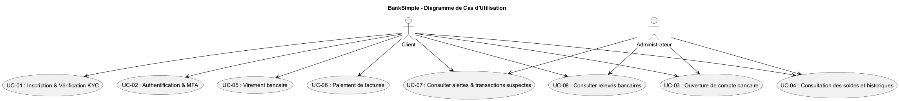

Le système permet aux clients bancaires de :
- Créer un profil client avec vérification d'identité (KYC)
- S'authentifier de façon sécurisée avec JWT et validation MFA par code OTP
- Ouvrir et gérer des comptes bancaires (chèques ou épargne)
- Consulter leurs soldes et l'historique de leurs transactions
- Effectuer des virements inter-comptes avec contrôle AML automatique

### Contexte technique
- **Applications clientes** : Postman, frontend web (React/Vite), applications mobiles
- **API Gateway** : Kong sur le port 8090, point d'entrée unique pour toutes les requêtes
- **Load Balancer** : nginx avec upstream `least_conn` pour distribuer la charge entre les réplicas
- **Microservices** : ClientService, AccountService, PaymentService — chacun sur le port 8080 interne
- **Persistance** : Trois bases PostgreSQL isolées (une par service) + Redis pour les codes OTP
- **Observabilité** : Prometheus scrape `/metrics` de chaque service, Grafana visualise les 4 Golden Signals

## 4. Stratégie de solution

| Problème | Approche choisie | Pourquoi |
|----------|-----------------|----------|
| **Isolation des domaines** | Clean Architecture — le domaine ne dépend d'aucune technologie externe | Permet de tester la logique métier sans base de données et de changer l'infrastructure sans toucher au domaine |
| **Scalabilité par service** | Décomposition en 3 microservices avec `deploy: replicas: N` docker-compose | Chaque service est sous une charge différente — PaymentService ne devrait pas être contraint par AccountService |
| **Authentification sécurisée** | JWT Bearer + MFA : login renvoie un OTP stocké dans Redis (TTL 5 min) | Un mot de passe seul ne suffit pas dans un contexte bancaire ; l'OTP expire automatiquement sans intervention |
| **Conformité AML** | Règles métier dans VirementService : seuil 10 000 CAD et > 60% du solde → statut Suspect | La règle est dans le domaine, pas dans le contrôleur — elle est testable et ne dépend pas d'HTTP |
| **Observabilité uniforme** | Middleware prometheus-net dans chaque service, dashboard Grafana centralisé | Sans métriques centralisées, diagnostiquer un problème dans un service parmi trois est difficile |
| **Point d'entrée unique** | Kong route toutes les requêtes vers nginx qui dispatche vers les services appropriés | Le client n'a pas besoin de connaître l'adresse de chaque service — Kong centralise CORS, rate limiting et métriques |
| **Load balancing** | nginx upstream avec `least_conn` distribue les requêtes équitablement entre les réplicas | `least_conn` envoie la requête au replica le moins occupé, ce qui évite de surcharger un seul conteneur |
| **Isolation des données** | Chaque microservice possède sa propre base PostgreSQL — pas de couplage entre services | Une base partagée crée des dépendances implicites entre domaines et empêche le déploiement indépendant |

## 5. Vue des blocs de construction
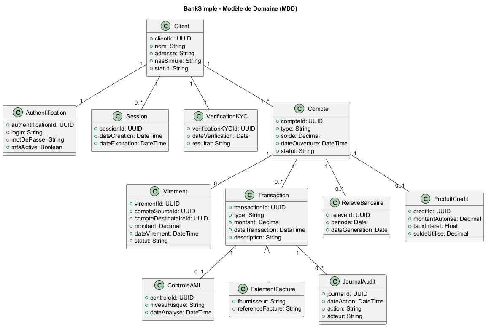

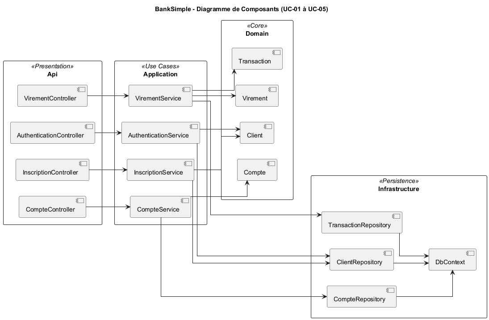

### Composants clés
- **ClientService** : Inscription, validation KYC, authentification JWT, génération et vérification OTP (Redis)
- **AccountService** : Gestion des comptes bancaires, dépôts, consultation des soldes et historiques
- **PaymentService** : Virements inter-comptes, détection AML, journal des transactions
- **Kong** : API Gateway — routage, CORS, rate limiting (50 000 req/min), plugin Prometheus
- **nginx** : Load balancer — upstream least_conn, proxy vers les 3 services
- **Redis** : Cache des codes OTP (TTL 5 min), nettoyage automatique après vérification
- **PostgreSQL** : Trois bases isolées avec transactions ACID, migrations EF Core reproductibles

## 6. Vue d'exécution

### UC-01 — Inscription & KYC
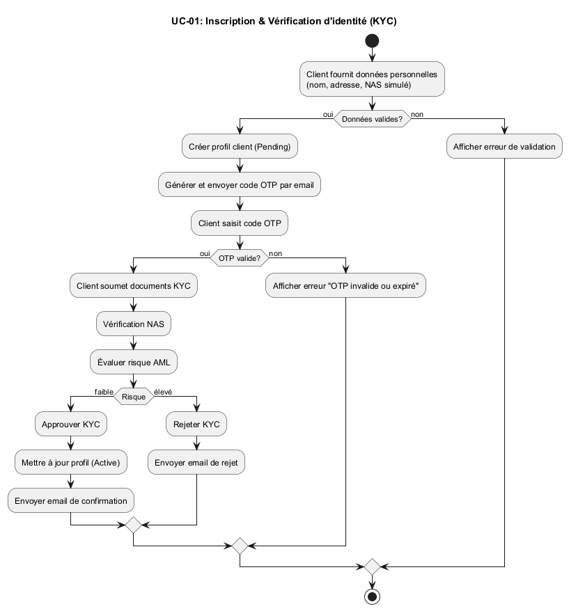

### UC-02 — Authentification & MFA

### UC-03 — Ouverture de compte
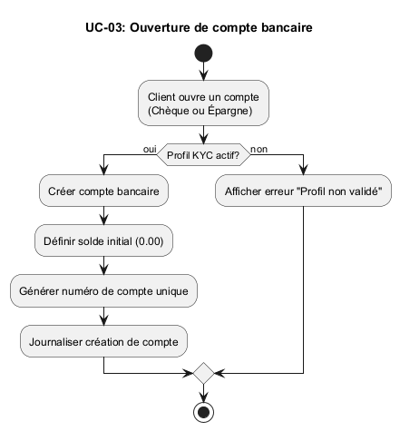

### UC-04 — Consultation des soldes
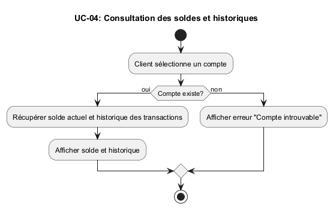

### UC-05 — Virement bancaire & AML

## 7. Vue de déploiement
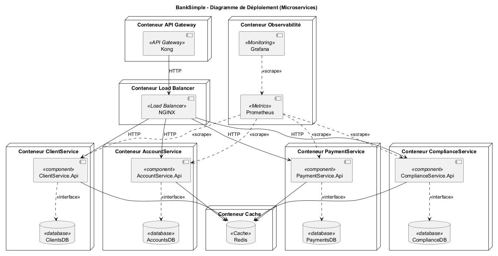

### Architecture conteneurs
- **banksimple-kong** : API Gateway Kong 3.6, port 8090, config déclarative `kong.yml`
- **banksimple-nginx** : Load balancer nginx alpine, expose le port 80 en interne
- **banksimple-client-service-[1..N]** : Microservice clients, port 8080, scalable
- **banksimple-account-service-[1..N]** : Microservice comptes, port 8080, scalable
- **banksimple-payment-service-[1..N]** : Microservice paiements, port 8080, scalable
- **banksimple-postgres** : PostgreSQL 16, port 5432, 3 bases isolées, volume persistant
- **banksimple-redis** : Redis 7 alpine, port 6379, cache OTP sans persistance
- **banksimple-prometheus** : Prometheus, port 9090, scrape toutes les 15s
- **banksimple-grafana** : Grafana, port 3000, dashboard 4 Golden Signals autoprovisionné

## 8. Concepts transversaux
- **Clean Architecture** : Dépendances dirigées vers l'intérieur — le domaine ignore EF Core et ASP.NET, ce qui le rend testable indépendamment
- **Authentification MFA** : Flux en deux étapes — login → OTP Redis → JWT final. L'OTP expire après 5 minutes, ce qui limite la fenêtre d'attaque
- **Détection AML** : Logique métier dans le domaine, pas dans les contrôleurs — un virement > 10 000 CAD ou > 60% du solde est automatiquement marqué Suspect
- **Transactions ACID** : `BeginTransactionAsync` / `CommitAsync` / `RollbackAsync` garantissent qu'un virement est atomique — les deux opérations réussissent ou aucune ne s'applique
- **Observabilité transversale** : Middleware prometheus-net injecté sans modifier le code métier — les métriques sont collectées automatiquement sur chaque requête HTTP
- **Load balancing** : nginx least_conn envoie chaque nouvelle requête au replica le moins occupé, ce qui évite de surcharger un seul conteneur sous pic de charge
- **API Gateway Pattern** : Kong centralise CORS, rate limiting et métriques en un seul endroit — aucun service n'a besoin de reconfigurer ces préoccupations lui-même
- **Database per Service** : Chaque microservice possède sa propre base, ce qui empêche les jointures inter-services et permet de modifier le schéma d'un service sans affecter les autres
- **Cache-aside** : Redis stocke les OTP avec un TTL de 5 minutes — à l'expiration, Redis les supprime automatiquement sans intervention

## 9. Décisions d'architecture
Veuillez consulter les fichiers dans `/docs/adr/` :
- [ADR-001](../adr/ADR-001-architecture-style.md) — Clean Architecture avec DDD
- [ADR-002](../adr/ADR-002-persistance-ef-postgresql.md) — PostgreSQL + Entity Framework Core
- [ADR-003](../adr/ADR-003-observabilite-prometheus-serilog.md) — Prometheus + Grafana + Serilog
- [ADR-004](../adr/ADR-004-decomposition-microservices.md) — Décomposition en microservices
- [ADR-005](../adr/ADR-005-api-gateway-kong.md) — API Gateway avec Kong

## 10. Exigences qualité

### Sécurité
- JWT Bearer HS256 avec expiration configurable (4h par défaut)
- MFA obligatoire : le JWT n'est émis qu'après validation du code OTP — un mot de passe seul ne suffit pas
- Détection AML : virements > 10 000 CAD ou > 60% du solde marqués comme `Suspect`, ce qui correspond aux exigences FINTRAC
- CORS centralisé dans Kong, ce qui évite toute duplication de configuration entre les services

### Performance

#### Test de charge progressif (k6 — `ramping-vus`, 5 → 15 VUs, 3m30s)

Distribution des requêtes : 60 % lectures comptes, 20 % dépôts, 20 % virements.

| N instances | P95 latence | P99 latence | Taux d'erreurs | Pic RPS |
|:-----------:|:-----------:|:-----------:|:--------------:|:-------:|
| 1 | ~25 ms | ~50 ms | 0 % | ~50 req/s |
| 2 | ~25 ms | ~45 ms | 0 % | ~50 req/s |
| 3 | ~25 ms | ~50 ms | 0 % | ~13 req/s |
| 4 | ~60 ms | ~115 ms | 0 % | ~9 req/s |

> N=3 et N=4 affichent un débit réduit en raison des ressources limitées de la machine locale (12 conteneurs .NET simultanés). Aucune erreur n'a été observée sur l'ensemble des scénarios — le système reste stable dans tous les cas.

**Captures Grafana :**

N=1 — 1 replica par service :

N=2 — 2 replicas par service :

N=3 — 3 replicas par service :
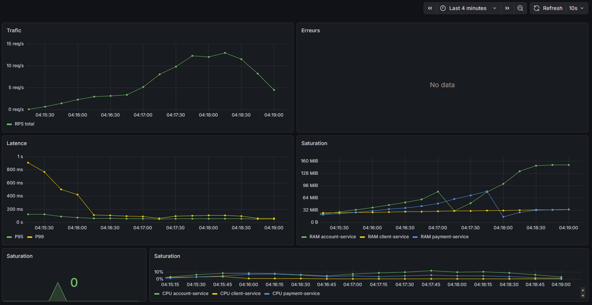

N=4 — 4 replicas par service :
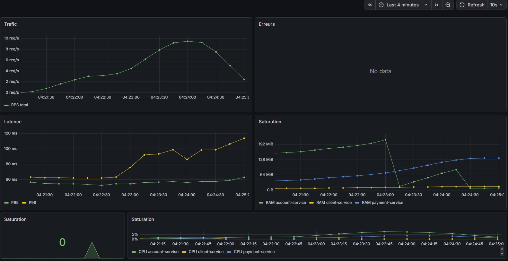

#### Test de stress (k6 — `ramping-arrival-rate`, spike 5 → 60 req/s)

| Métrique | Valeur observée | Seuil NFR |
|----------|:--------------:|:---------:|
| P95 latence | ~55 ms | ≤ 500 ms ✓ |
| P99 latence | ~63 ms | ≤ 1 000 ms ✓ |
| Taux d'erreurs | 0 % | ≤ 5 % ✓ |
| Pic absorbé | ~40 req/s | — |

Le système a absorbé un pic de 60 req/s cible sans aucune erreur. La latence augmente légèrement sous spike (~15 ms → ~55 ms P95) puis se stabilise — comportement attendu et sain.

**Capture Grafana — stress test :**
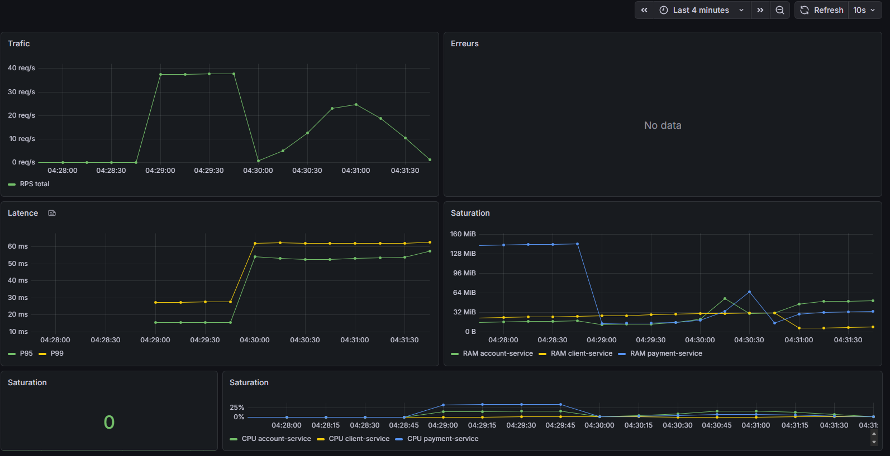

#### Test de tolérance aux pannes (kill d'instances sous charge)

Scénario : load-test en cours (N=2) → suppression simultanée de toutes les instances `-2` de chaque service en pleine charge.

| Métrique | Valeur observée | Interprétation |
|----------|:--------------:|----------------|
| Requêtes totales | 2 603 | — |
| Erreurs | **3 (0.11 %)** | Requêtes en vol au moment du kill |
| P95 global | 47 ms | ✓ sous 500 ms |
| P99 global | 3.14 s | Gonflé par les 3 timeouts du kill |
| Succès total | **99.88 %** | nginx a redirigé instantanément |

Seules les 3 requêtes en cours d'exécution au moment du `docker stop` ont échoué. Toutes les requêtes suivantes ont été automatiquement redirigées vers les instances survivantes par nginx `least_conn` — aucune interruption visible pour le reste du trafic.

**Capture Grafana — tolérance aux pannes :**
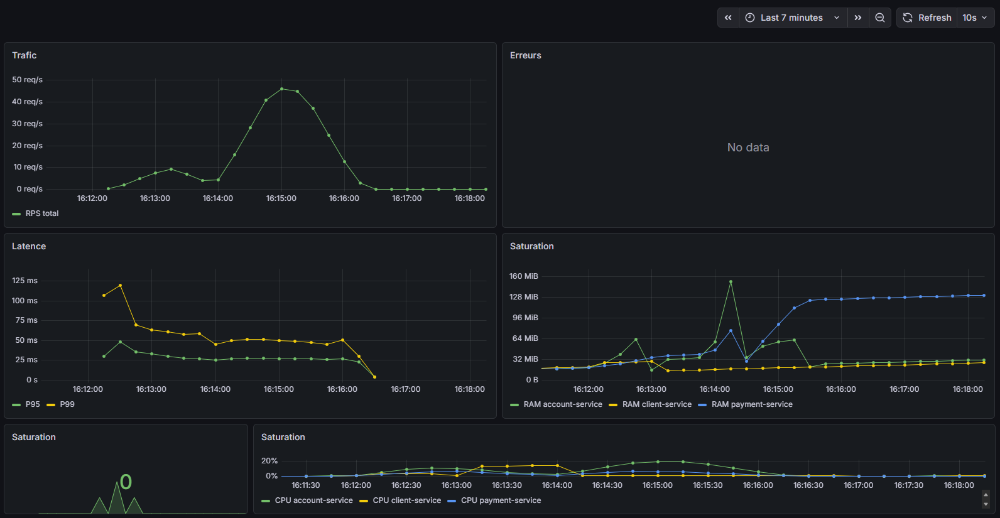

### Observabilité
- 4 Golden Signals disponibles en temps réel pour chaque service dans Grafana
- Logs JSON structurés (Serilog) avec TraceId, StatusCode et durée par requête — ce qui permet de corréler une requête précise avec ses logs
- Métriques Kong (requêtes, latence, erreurs) intégrées au même dashboard Prometheus

### Scalabilité
- Chaque microservice est répliqué indépendamment : `docker compose up --scale account-service=4`
- nginx upstream s'adapte automatiquement aux nouveaux conteneurs via DNS Docker interne

## 11. Risques et dettes techniques

| Risque | Impact | Mitigation |
|--------|--------|------------|
| **Cohérence inter-services** | PaymentService appelle AccountService en HTTP — pas de transaction distribuée | Idempotence des opérations, rollback manuel en cas d'échec partiel |
| **Sécurité des mots de passe** | Hachage SHA256 utilisé en phase 1 (non recommandé pour la production) | Prévu bcrypt en phase 2 |
| **Perte du cache Redis** | Redis configuré sans persistance — redémarrage vide le cache OTP | Sessions OTP courtes (5 min) minimisent l'impact ; acceptable en phase 1 |
| **HTTPS absent** | Communication en HTTP en phase 1 | HTTPS obligatoire avant mise en production |
| **Tracing distribué absent** | Pas de corrélation de traces entre les 3 services | OpenTelemetry prévu en phase 2 |

## 12. Glossaire

| Terme | Définition |
|-------|------------|
| **AML** | Anti-Money Laundering : détection automatique de transactions financières suspectes |
| **API Gateway** | Point d'entrée unique qui centralise le routage, la sécurité et les métriques |
| **Clean Architecture** | Style architectural avec dépendances dirigées vers le domaine métier central |
| **DDD** | Domain-Driven Design : modélisation centrée sur le domaine métier |
| **Golden Signals** | Les 4 métriques fondamentales d'observabilité : latence, trafic, erreurs, saturation |
| **JWT** | JSON Web Token : token signé pour l'authentification sans état |
| **KYC** | Know Your Customer : vérification obligatoire de l'identité d'un client bancaire |
| **Kong** | API Gateway open-source utilisé pour le routage, rate limiting et CORS |
| **MFA** | Multi-Factor Authentication : vérification en deux étapes (mot de passe + OTP) |
| **nginx** | Serveur web utilisé ici comme load balancer avec l'algorithme least_conn |
| **OTP** | One-Time Password : code à usage unique stocké dans Redis (TTL 5 min) |
| **Rate Limiting** | Limite le nombre de requêtes par minute pour protéger les services |
| **Redis** | Base de données clé-valeur en mémoire utilisée pour le cache OTP |
| **Replica** | Instance supplémentaire d'un microservice pour la scalabilité horizontale |

## Conclusion

Ce projet m'a permis de concevoir et d'implémenter une plateforme bancaire complète répondant aux exigences fonctionnelles et non-fonctionnelles du cahier de charge. Pour atteindre les objectifs de performance, j'ai opté pour une décomposition en trois microservices indépendants, chacun doté de sa propre base de données PostgreSQL et orchestrés derrière un load balancer nginx en mode `least_conn`. Cette approche a permis d'atteindre une latence P95 de 25 ms sous charge normale, bien en deçà du seuil de 500 ms fixé.

Concernant la disponibilité et la résilience, les tests de tolérance aux pannes ont démontré que le système maintient un taux de succès de 99,88 % même lors de la suppression forcée d'instances en cours d'exécution. Seules les 3 requêtes en vol au moment du kill ont échoué — nginx a redirigé instantanément le trafic vers les instances survivantes, sans intervention manuelle.

Sur le plan de la sécurité, j'ai mis en place une authentification en deux étapes (JWT + OTP via Redis) combinée à la détection AML sur les virements suspects. J'ai choisi de centraliser le CORS, le rate limiting et les métriques dans Kong plutôt que dans chaque service — ce qui évite la duplication de configuration et garantit une politique uniforme sur toute l'API.

En résumé, ce projet démontre qu'une architecture microservices rigoureusement documentée (Arc42, ADRs, 4+1), instrumentée pour l'observabilité (Prometheus + Grafana) et validée par des tests de charge réalistes (k6), constitue une fondation fiable pour une application bancaire évolutive et résiliente.
