# BankSimple — Documentation d'Architecture (Arc42)

---

| | |
|---|---|
| **Étudiant** | Jad Bizri |
| **Code permanent** | BIZJ81330201 |
| **Cours** | GTI611 — Architecture logicielle |
| **Projet** | Phase 1 — Plateforme bancaire BankSimple |
| **Date** | Mars 2026 |
| **GitHub** | [https://github.com/Toksunus/banksimple](https://github.com/Toksunus/banksimple) |

---

## Grille d'évaluation

| Critère | Pondération | Réalisations |
|---------|:-----------:|---|
| **1. Analyse métier & DDD** | 15 % | 5 UC implémentés, Clean Architecture + DDD, bounded contexts isolés |
| **2. API REST & Sécurité** | 15 % | Endpoints versionnés /api/v1, JWT + MFA (OTP Redis), CORS Kong, Swagger, Postman |
| **3. Persistance & Intégrité** | 15 % | 3 BDs PostgreSQL isolées, EF Core, audit logs append-only, idempotence|
| **4. Observabilité & Charge** | 20 % | 4 Golden Signals Grafana, k6 load-test (N=1–4) + stress test + kill instance |
| **5. LB & Caching** | 10 % | nginx least_conn, cache Redis OTP (5 min), gains mesurés |
| **6. Microservices & Gateway** | 15 % | 3 microservices, Kong (routage, CORS, rate limiting, Prometheus)|
| **7. Doc & Décisions** | 10 % | Arc42 (1–12), 4+1 (19 vues PlantUML : use case, classe, composant, 2 déploiements, 5 activités, 10 séquences), 5 ADRs, README |

## Introduction

Ce projet représente la conception et l'implémentation complète d'une plateforme bancaire en ligne, BankSimple. Partant d'une analyse du domaine bancaire canadien et de ses exigences réglementaires (FINTRAC, OSFI, LPRPDE), j'ai élaboré une architecture capable de répondre aux règlements de sécurité et de performance.

La phase 1 avait comme point de départ la modélisation des cas d'utilisation fondamentaux : inscription et vérification d'identité (KYC), authentification, gestion de comptes et virements avec détection AML. C'est cette analyse du domaine qui m'a convaincu d'adopter la Clean Architecture avec DDD et de découper le système en microservices indépendants.

Mon objectif principal était d'exposer une API RESTful, tout en démontrant des gains mesurables sur la latence, le débit et la disponibilité. Pour ça, j'ai mis en place plusieurs outils d'observabilité (Prometheus + Grafana) permettant de visualiser les 4 Golden Signals en temps réel, ce qui m'a permis de créer des scénarios de charge réalistes pour tester la stabilité de l'architecture.

Ce que ce projet m'a montré, c'est qu'avec les bons outils (Kong, nginx, Prometheus) bien assemblés, une architecture microservices peut être à la fois performante, résiliente et déployable en une commande.

## 1. Introduction et Objectifs

### Panorama des exigences
**BankSimple** est une plateforme bancaire canadienne destinée aux particuliers. Elle expose une API RESTful sécurisée couvrant les cas d'utilisation bancaires fondamentaux et sert de projet pour démontrer :
- L'implémentation d'une architecture microservices en Clean Architecture avec principes DDD
- L'exposition sécurisée d'une API REST versionnée avec authentification JWT et MFA
- L'observabilité complète via les 4 Golden Signals (Prometheus + Grafana)
- Le load balancing avec nginx et la scalabilité horizontale par réplication des services
- La gestion des sessions et du cache avec Redis (OTP à durée limitée)
- L'utilisation d'une API Gateway (Kong) pour le routage, CORS, rate limiting et métriques
- La conformité réglementaire canadienne (FINTRAC, OSFI, LPRPDE) avec détection AML

### Objectifs qualité
| Priorité | Objectif qualité | Scénario |
|----------|------------------|----------|
| 1 | **Sécurité** | Authentification JWT + MFA par code OTP, détection AML sur les virements suspects |
| 2 | **Performance** | Latence P95 ≤ 500 ms sous 150 VUs simultanés, débit ≥ 600 ops/s |
| 3 | **Observabilité** | 4 Golden Signals visibles en temps réel dans Grafana pour chaque microservice |
| 4 | **Scalabilité** | Chaque microservice peut être répliqué indépendamment via `replicas` docker-compose |
| 5 | **Maintenabilité** | Séparation stricte Domain/Application/Infrastructure, testabilité par mocking |
| 6 | **Reproductibilité** | Déploiement complet en une commande `docker compose up --build` en < 5 minutes |

### Parties prenantes
- **Clients bancaires** : Ils gèrent leurs comptes, font des virements et consultent leurs soldes via l'API
- **Régulateurs (FINTRAC, OSFI)** : Ils ont besoin de journaux d'audit immuables et d'une détection AML conforme
- **Développeurs** : Le code doit être testable par service et facile à modifier sans tout casser
- **DevOps** : Le système doit être observable en temps réel et redéployable en une commande

## 2. Contraintes d'architecture

| Contrainte | Description |
|------------|-------------|
| **Technologie** | C# / .NET 8, PostgreSQL, Redis, Kong, nginx, Docker |
| **Déploiement** | Conteneurs Docker orchestrés par docker-compose, CI/CD self-hosted runner |
| **Performance** | Latence P95 ≤ 500 ms |
| **Sécurité** | JWT Bearer HS256, MFA par OTP (Redis TTL 5 min), validation des entrées, CORS via Kong |
| **Conformité** | Détection AML, journaux append-only |
| **API** | Routes versionnées `/api/v1`, codes HTTP standards, Swagger |
| **API Gateway** | Kong comme point d'entrée unique pour le routage, rate limiting et métriques agrégées |

## 3. Portée et contexte du système

### Contexte métier

Le système permet aux clients bancaires de :
- Créer un profil client avec vérification d'identité (KYC)
- S'authentifier de façon sécurisée avec JWT et validation MFA par code OTP
- Ouvrir et gérer des comptes bancaires (chèques ou épargne)
- Consulter leurs soldes et l'historique de leurs transactions
- Effectuer des virements vers des comptes internes ou externes avec contrôle AML automatique

### Contexte technique
- **Applications clientes** : Postman, frontend web (React)
- **API Gateway** : Kong, point d'entrée unique pour toutes les requêtes
- **Load Balancer** : nginx avec upstream `least_conn` afin de distribuer la charge
- **Microservices** : ClientService, AccountService, PaymentService
- **Persistance** : Trois bases PostgreSQL isolées (une par service) + Redis pour les codes OTP
- **Observabilité** : Prometheus collecte `/metrics` de chaque service, Grafana visualise les 4 Golden Signals

## 4. Stratégie de solution

| Problème | Approche choisie | Pourquoi |
|----------|-----------------|----------|
| **Isolation des domaines** | Clean Architecture, le domaine ne dépend d'aucune technologie externe | Si EF Core ou PostgreSQL change, le domaine ne bouge pas. La logique bancaire (AML, KYC) est testable sans base de données active |
| **Scalabilité par service** | 3 microservices indépendants dans docker-compose | Les virements et les comptes ne sont pas sous la même charge, je veux pouvoir scaler PaymentService sans toucher aux autres |
| **Authentification sécurisée** | JWT Bearer + OTP stocké dans Redis (TTL 5 min), vérification en deux étapes | Un mot de passe seul c'est pas assez dans un contexte bancaire. L'OTP expire tout seul après 5 min sans que j'aie à gérer ça manuellement |
| **Conformité AML** | Règles dans VirementService : > 10 000 CAD ou > 60% du solde → statut Suspect | Règle dans le domaine comme ça elle est testable à part |
| **Observabilité uniforme** | Middleware prometheus-net dans chaque service, dashboard Grafana centralisé | Avec trois services indépendants, j'avais besoin de tout voir au même endroit |
| **Point d'entrée unique** | Kong route toutes les requêtes vers nginx qui dispatche vers les services | Le frontend n'a pas besoin de connaître l'adresse de chaque service. Kong gère le CORS, le rate limiting et les métriques une seule fois pour tout |
| **Load balancing** | nginx upstream least_conn distribue les requêtes | least_conn envoie chaque requête au replica le moins occupé |
| **Isolation des données** | Chaque service a sa propre base PostgreSQL, aucune jointure inter-services | Une base partagée crée des dépendances entre domaines et empêche le déploiement indépendant |

## 5. Vue des blocs de construction

### Composants clés
- **ClientService** : Inscription, validation KYC, authentification JWT, génération et vérification OTP (Redis)
- **AccountService** : Gestion des comptes bancaires, dépôts, consultation des soldes et historiques
- **PaymentService** : Virements, détection AML, journal des transactions
- **Kong** : API Gateway — routage, CORS, rate limiting (50 000 req/min), plugin Prometheus
- **nginx** : Load balancer — upstream least_conn, proxy vers les 3 services
- **Redis** : Cache des codes OTP (TTL 5 min), nettoyage automatique après vérification
- **PostgreSQL** : Trois bases isolées avec transactions ACID, migrations EF Core reproductibles

## 6. Vue d'exécution

### UC-01 — Inscription & KYC

#### Diagramme de séquence — Inscription
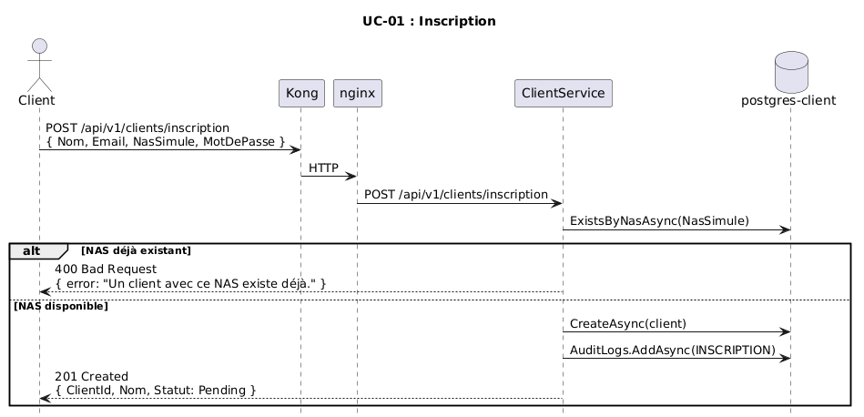

#### Diagramme de séquence — Validation KYC
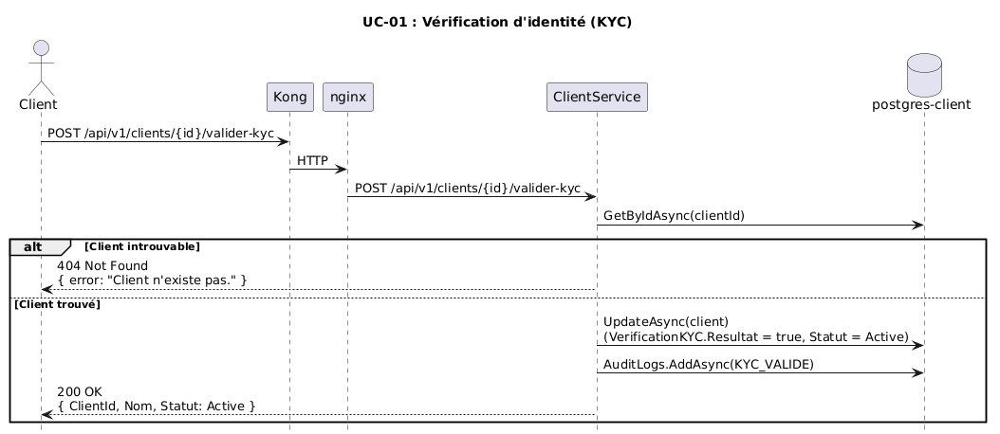

### UC-02 — Authentification & MFA
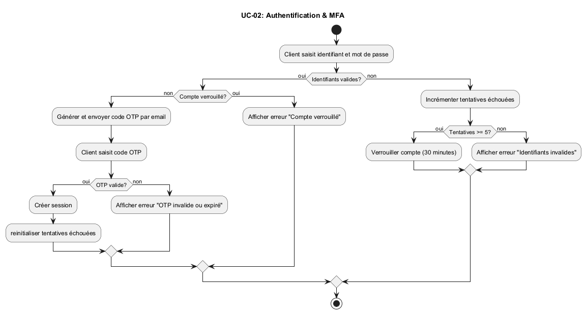

#### Diagramme de séquence — Login
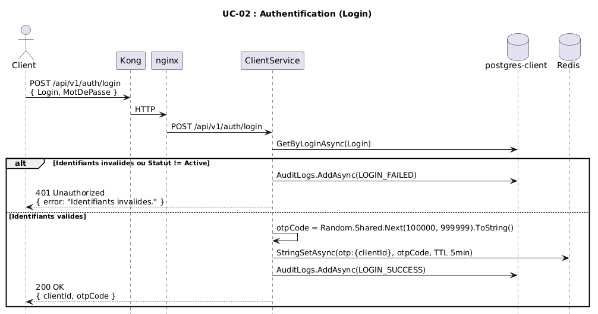

#### Diagramme de séquence — Vérification OTP
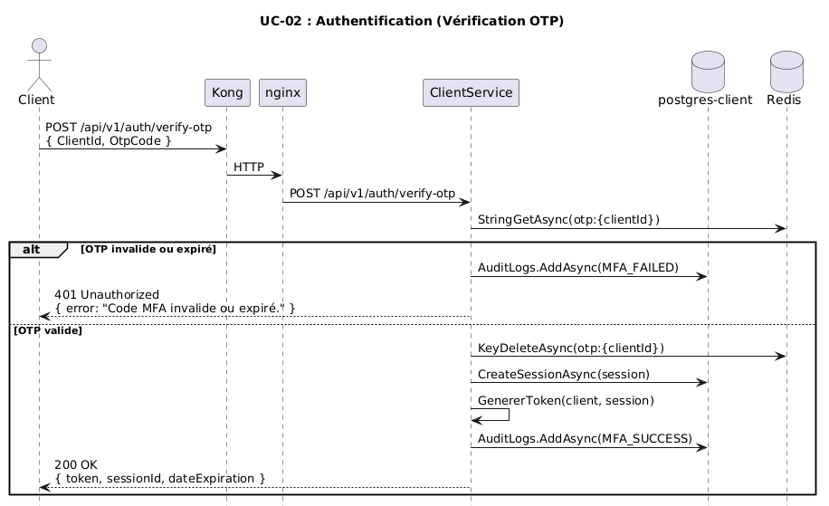

### UC-03 — Ouverture de compte

#### Diagramme de séquence — Ouverture de compte
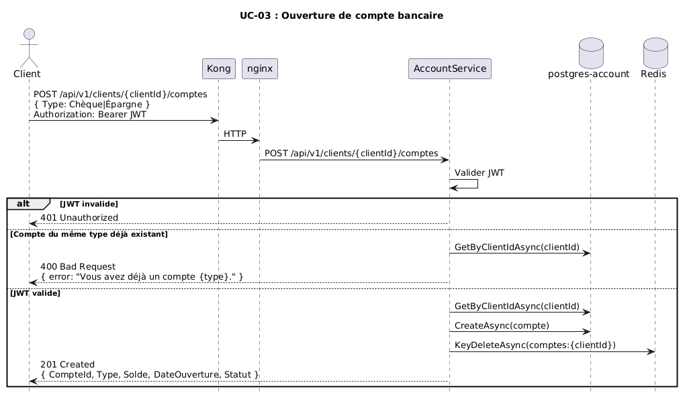

### UC-04 — Consultation des soldes

#### Diagramme de séquence — Consultation des comptes
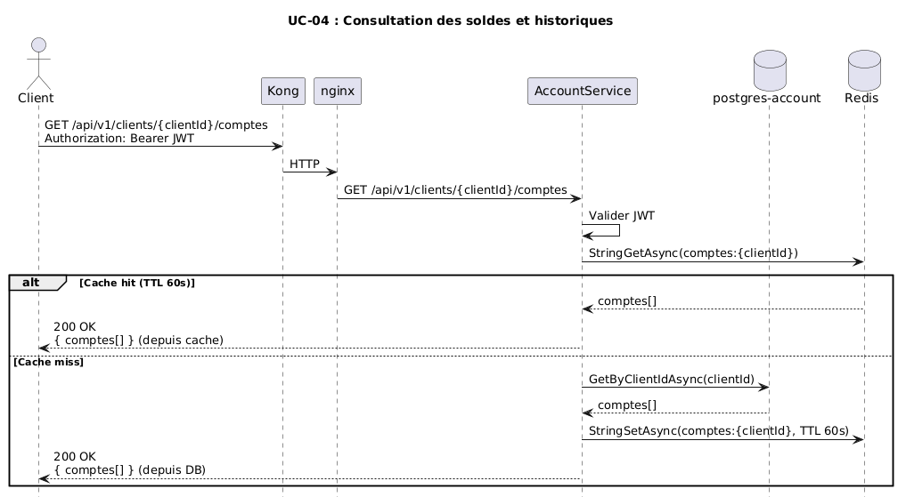

### UC-05 — Virement bancaire & AML
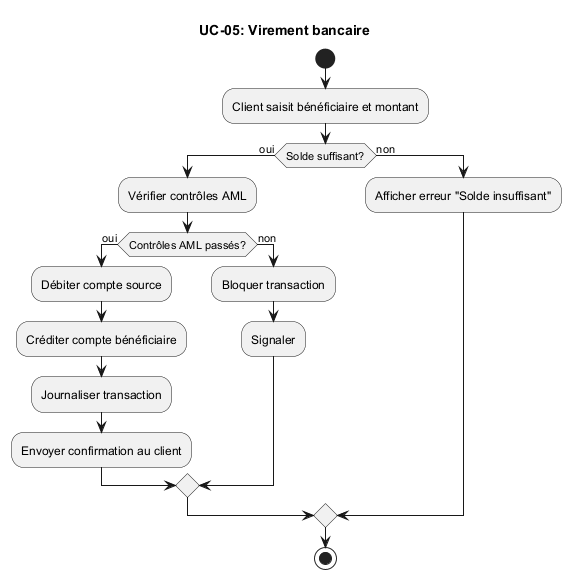

#### Diagramme de séquence — Virement interne
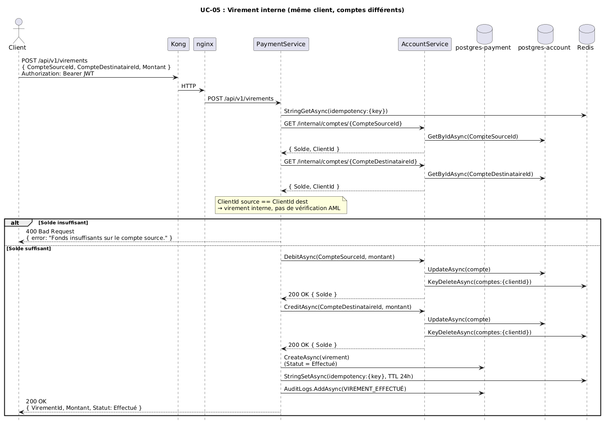

#### Diagramme de séquence — Virement externe (AML)
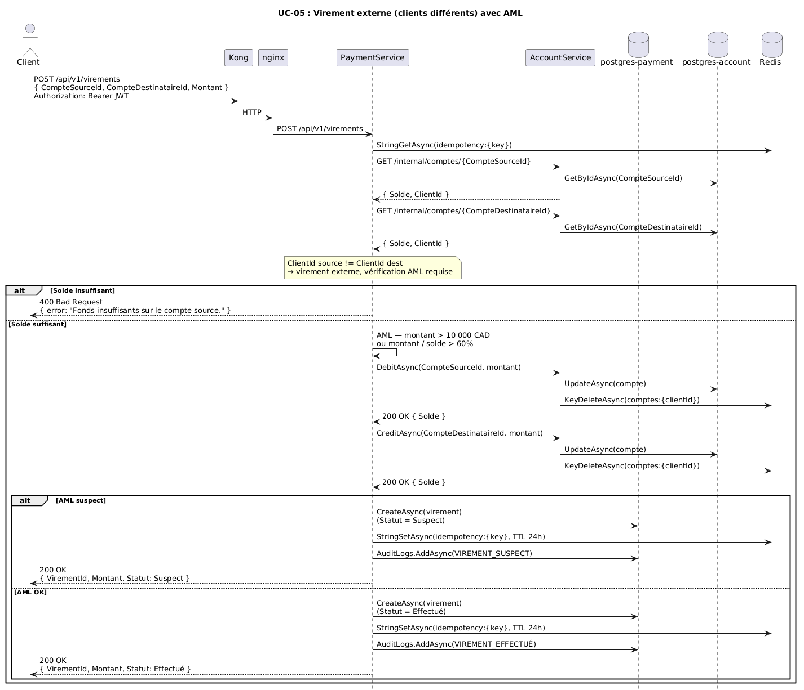

#### Diagramme de séquence — Idempotence
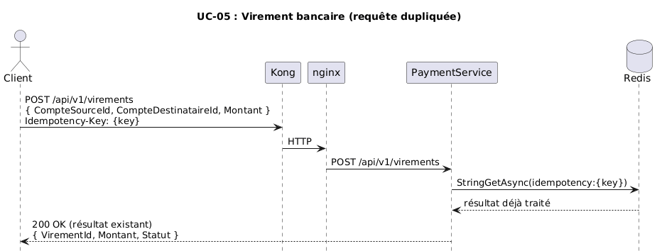

#### Diagramme de séquence — Compensation (rollback)
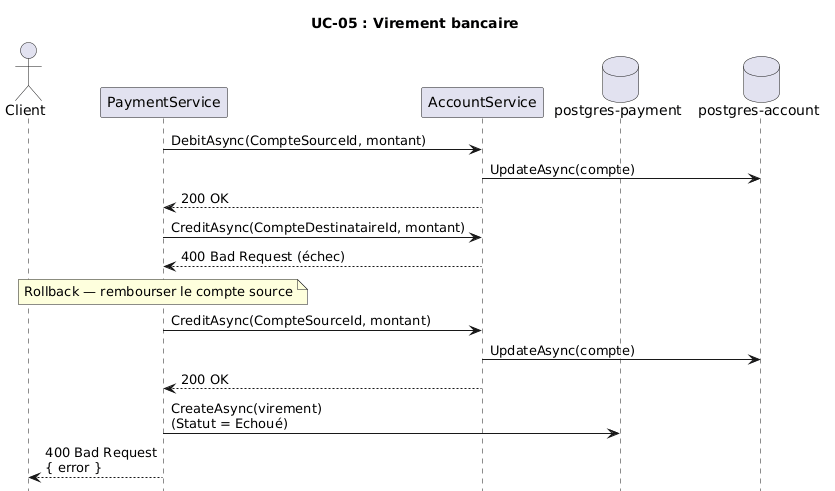

## 7. Vue de déploiement

### Version 1 — PostgreSQL partagé (architecture initiale)

### Version 2 — PostgreSQL dédié par service (architecture corrigée)
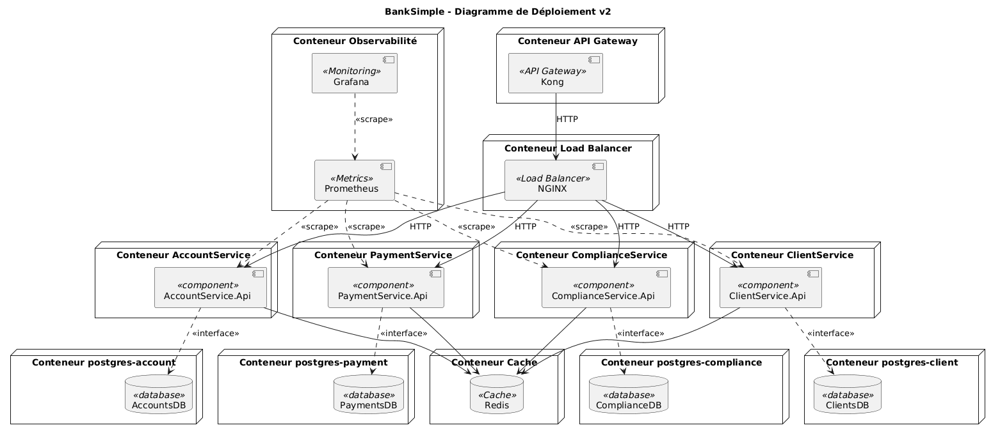

### Architecture conteneurs
- **banksimple-kong** : API Gateway Kong 3.6, port 8090, config déclarative `kong.yml`
- **banksimple-nginx** : Load balancer nginx alpine, expose le port 80 en interne
- **banksimple-client-service-[1..N]** : Microservice clients, port 8080, scalable
- **banksimple-account-service-[1..N]** : Microservice comptes, port 8080, scalable
- **banksimple-payment-service-[1..N]** : Microservice paiements, port 8080, scalable
- **banksimple-postgres** : PostgreSQL 16, port 5432, 3 bases isolées, volume persistant
- **banksimple-redis** : Redis 7 alpine, port 6379, cache OTP sans persistance
- **banksimple-prometheus** : Prometheus, port 9090, scrape toutes les 15s
- **banksimple-grafana** : Grafana, port 3000, dashboard 4 Golden Signals autoprovisionné

## 8. Concepts transversaux

| Concept | Description | Pourquoi |
|---------|-------------|----------|
| **Audit logs append-only** | Chaque action sensible (inscription, login, virement) est enregistrée dans une table `AuditLogs` dans les trois services | Traçabilité complète pour la conformité FINTRAC — les logs ne sont jamais modifiés |
| **Idempotence des virements** | Le contrôleur vérifie une clé `Idempotency-Key` dans Redis avant de traiter un virement | Évite les doublons si le client renvoie la même requête après un timeout |
| **Format d'erreur uniforme** | Tous les contrôleurs retournent `{ "error": "message" }` avec le bon code HTTP (400, 401, 404) | Le frontend peut gérer les erreurs de façon identique peu importe le service qui répond |
| **Swagger activé sur les trois services** | Chaque service expose `/swagger` avec la documentation complète de ses endpoints | Facilite les tests manuels et sert de contrat d'API sans documentation externe |

## 9. Décisions d'architecture
Voir `/docs/adr/` :
- [ADR-001](../adr/ADR-001-architecture-style.md) — Clean Architecture avec DDD
- [ADR-002](../adr/ADR-002-persistance-ef-postgresql.md) — PostgreSQL + Entity Framework Core
- [ADR-003](../adr/ADR-003-observabilite-prometheus-serilog.md) — Prometheus + Grafana + Serilog
- [ADR-004](../adr/ADR-004-decomposition-microservices.md) — Décomposition en microservices
- [ADR-005](../adr/ADR-005-api-gateway-kong.md) — API Gateway avec Kong
- [ADR-006](../adr/ADR-006-saga-interbanques-bbc.md) — Saga orchestrée pour les virements internes

## 10. Exigences qualité

### Sécurité
- JWT Bearer HS256 avec expiration configurable (4h par défaut)
- MFA obligatoire : le JWT n'est émis qu'après validation du code OTP, un mot de passe seul ne suffit pas
- Détection AML : virements > 10 000 CAD ou > 60% du solde marqués comme Suspect
- CORS centralisé dans Kong, ce qui évite toute duplication de configuration entre les services

### Performance

#### Test de charge progressif — Version 1 (k6, 5 → 15 VUs + sleep 0.5s)

Distribution des requêtes : 60 % lectures comptes, 20 % dépôts, 20 % virements.

> **Note sur la méthodologie** : ces résultats de la version 1 étaient faussés par deux problèmes que j'ai identifiés après. D'abord, j'avais mis un `sleep(0.5)` dans le script k6, ce qui limitait le débit peu importe la capacité du système. Ensuite, la base de données était dans le même conteneur que le service. Cela signifie qu'à N=3, Docker crée 3 copies du conteneur complet, donc 3 APIs et 3 bases de données isolées. Chaque instance avait ses propres données, ce qui brisait la cohérence : un client créé sur l'instance 1 n'existait pas sur l'instance 2. J'ai corrigé ça en version 2 en séparant chaque DB dans son propre conteneur dédié, pour que toutes les instances d'un service partagent une seule source de données. Ces deux facteurs ensemble m'empêchaient de voir le vrai comportement du système sous charge, c'est pourquoi j'ai refait les tests en version 2 avec une configuration corrigée.

| N instances | P95 latence | P99 latence | Taux d'erreurs | Pic RPS | RPS relatif à N=1 |
|:-----------:|:-----------:|:-----------:|:--------------:|:-------:|:-----------------:|
| 1 | ~25 ms | ~50 ms | 0 % | ~50 req/s | 100 % |
| 2 | ~25 ms | ~45 ms | 0 % | ~50 req/s | 100 % |
| 3 | ~25 ms | ~50 ms | 0 % | ~13 req/s | 26 % |
| 4 | ~60 ms | ~115 ms | 0 % | ~9 req/s | 18 % |

**Captures Grafana :**

N=1 — 1 replica par service :
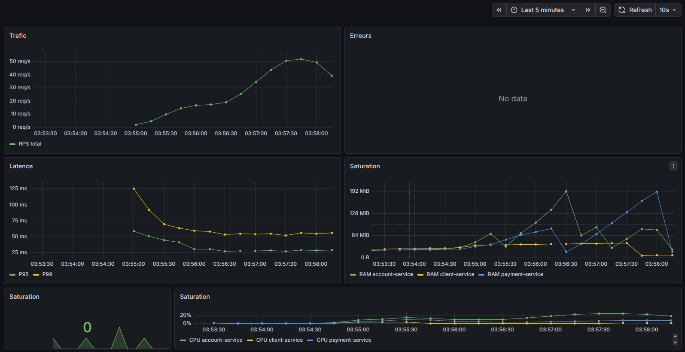

N=2 — 2 replicas par service :
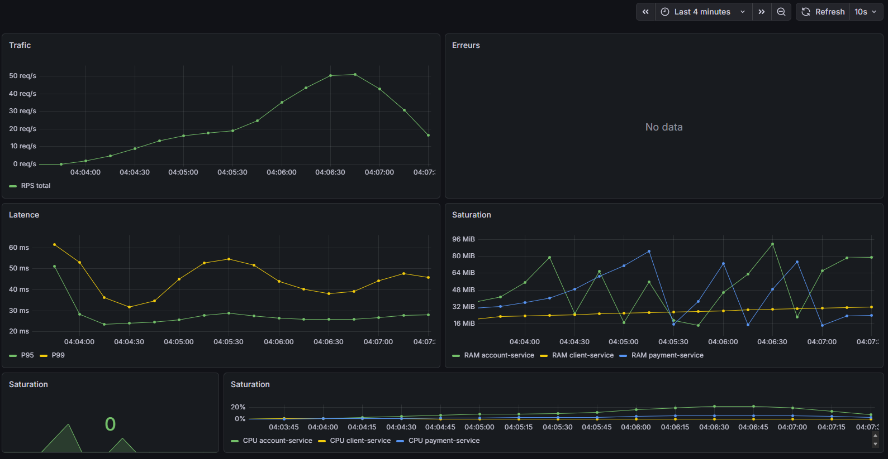

N=3 — 3 replicas par service :

N=4 — 4 replicas par service :

#### Test de charge progressif — Version 2 (k6, 5 → 25 VUs, postgres dédié)

> **Correction** : le `sleep(0.5)` a été retiré et les VUs augmentés à 25 pour mesurer le débit réel du système. Le postgres partagé a été remplacé par 3 conteneurs PostgreSQL dédiés (un par type de service).

| N instances | P95 latence | P99 latence | Taux d'erreurs | Pic RPS | RPS relatif à N=1 |
|:-----------:|:-----------:|:-----------:|:--------------:|:-------:|:-----------------:|
| 1 | ~200 ms | ~430 ms | 0 % | ~430 req/s | 100 % |
| 2 | ~200 ms | ~400 ms | 0 % | ~375 req/s | 87 % |
| 3 | ~100 ms | ~400 ms | 0 % | ~300 req/s | 70 % |
| 4 | ~200 ms | ~400 ms | 0 % | ~310 req/s | 72 % |

La légère diminution du RPS à N=2,3,4 s'explique par l'overhead Docker/nginx sur une machine locale — avec 25 VUs, une seule instance suffit déjà à absorber la charge sans saturation. Le gain architectural se mesure dans le **comportement relatif** : avant le correctif, N=3 tombait à 26% du N=1. Avec le changement, il a monté à 70%.

**Captures Grafana :**

N=1 — 1 replica par service :
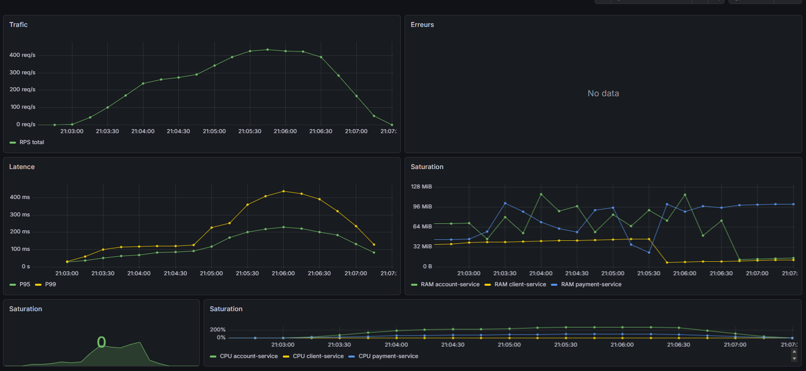

N=2 — 2 replicas par service :
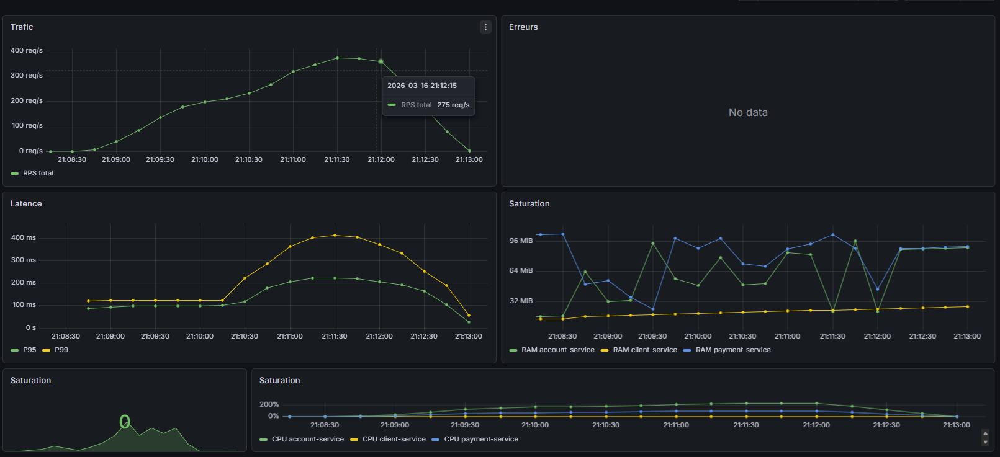

N=3 — 3 replicas par service :
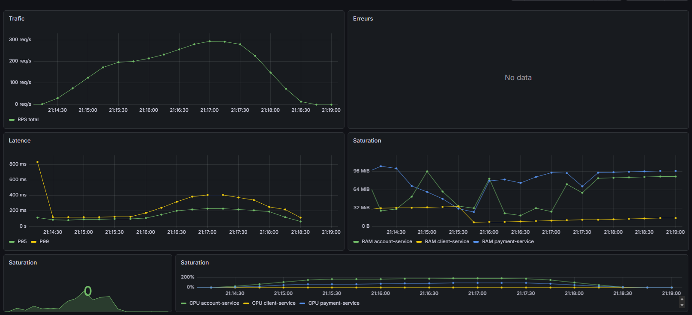

N=4 — 4 replicas par service :
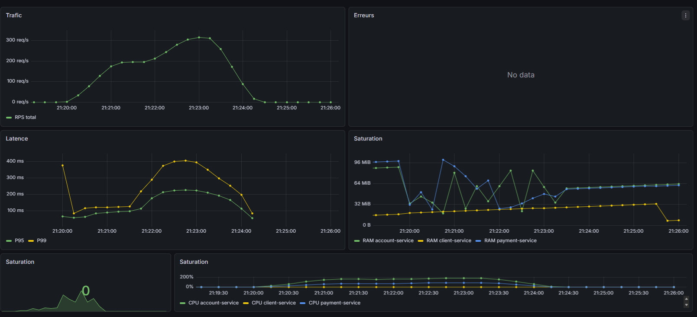

#### Test de stress (k6, spike 5 → 60 req/s)

| Métrique | Valeur observée | Seuil NFR |
|----------|:--------------:|:---------:|
| P95 latence | ~55 ms | ≤ 500 ms ✓ |
| P99 latence | ~63 ms | ≤ 1 000 ms ✓ |
| Taux d'erreurs | 0 % | ≤ 5 % ✓ |
| Pic absorbé | ~40 req/s | — |

Le système a absorbé un pic de 60 req/s cible sans aucune erreur. La latence augmente légèrement sous spike puis se stabilise, c'est un comportement normal.

**Capture Grafana — stress test version 1 :**

En version 2, le pic réel atteint ~45 req/s avec 0 erreur et une latence P95 stable sous 50 ms. Ce sont des résultats similaires à la version 1 mais avec une consommation RAM plus faible (~96 MiB vs 160 MiB).

**Capture Grafana — stress test version 2 :**
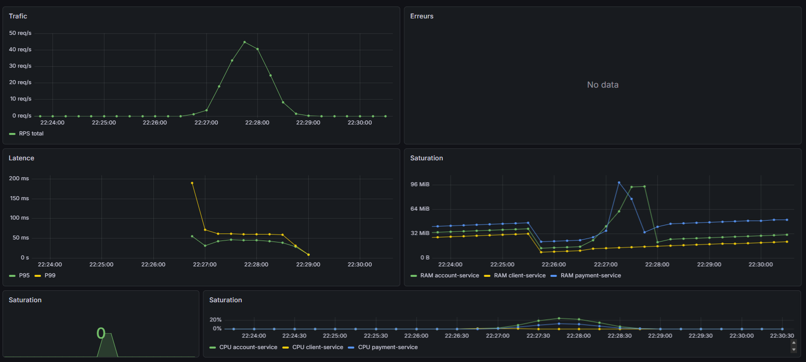

#### Test de tolérance aux pannes (kill d'instances sous charge)

Scénario : load-test en cours (N=2)

| Métrique | Valeur observée | Interprétation |
|----------|:--------------:|----------------|
| Requêtes totales | 2 603 | — |
| Erreurs | **3 (0.11 %)** | Requêtes en vol au moment du kill |
| P95 global | 47 ms | ✓ sous 500 ms |
| P99 global | 3.14 s | Gonflé par les 3 timeouts du kill |
| Succès total | **99.88 %** | nginx a redirigé instantanément |

Seules les 3 requêtes en cours d'exécution au moment du docker stop ont échoué. Toutes les requêtes suivantes ont été automatiquement redirigées vers les instances survivantes par nginx least_conn.

**Capture Grafana — tolérance aux pannes :**

### Observabilité
- 4 Golden Signals disponibles en temps réel pour chaque service dans Grafana
- Logs JSON structurés (Serilog), StatusCode et durée par requête
- Métriques Kong (requêtes, latence, erreurs) intégrées au même dashboard Prometheus

### Scalabilité
- Chaque microservice est répliqué indépendamment : `docker compose up --scale account-service=4`

## Analyse critique de l'architecture

### Problème identifié : base de données dans le même conteneur que le service

Dans ma version 1, la base de données était dans le même conteneur que le service API. Le problème concret est le suivant : quand Docker crée N=3 replicas d'un service, il crée 3 copies du conteneur complet — donc 3 APIs et 3 bases de données. Chaque instance avait ses propres données, ce qui brisait la cohérence entre les replicas. Dans une application bancaire, cela signifie qu'un client créé sur l'instance 1 n'existait tout simplement pas sur l'instance 2.

### Correction

J'ai séparé chaque base de données dans son propre conteneur dédié (`postgres-client`, `postgres-account`, `postgres-payment`). Maintenant, quand je crée N replicas d'un service, toutes les instances partagent le même conteneur de base de données.

### Observation

En version 2, j'ai observé que le RPS passe de ~430 req/s à N=1 à ~375 req/s à N=2, puis ~300 req/s à N=3 et N=4. Selon moi, il y a une raison qui explique ça :

**La machine locale fait tout en même temps.** À N=4, j'ai 12 instances de services + 3 postgres + Redis + Kong + nginx + Prometheus + Grafana = ~20 conteneurs sur la même machine. Chaque conteneur consomme CPU et RAM. En production, ce problème n'existe pas, car cette tâche est effectué sur des machines dédiées séparées.

### Ce qui est fait

- **Isolation des services** : chaque microservice a son domaine, sa DB et son API indépendants
- **Compensation pattern** : si un virement échoue à mi-chemin, le système rembourse automatiquement le compte source
- **Idempotence** : une requête de virement en double est détectée via Redis et ignorée
- **Observabilité** : Prometheus + Grafana donnent une vue en temps réel du trafic, de la latence et de la saturation
- **Sécurité** : JWT + MFA (OTP via Redis avec TTL 5 min), rate limiting via Kong

### Problème identifié et résolu — Sage Orchestrée des virements internes

Un virement interne implique deux opérations séquentielles : débiter le compte source et créditer le compte destinataire. Sans mécanisme de coordination, si le crédit échoue après le débit, le client perd son argent et le système reste dans un état incohérent.

J'ai implémenté un `VirementSagaOrchestrator` qui coordonne ces deux étapes avec compensation automatique. Chaque étape est persistée en base via un `VirementSaga`. Si le débit réussit mais que le crédit échoue, le compte source est automatiquement recrédité. Si la compensation elle-même échoue, l'état `CompensationEchouée` est enregistré pour intervention manuelle. Cette implémentation est documentée dans l'[ADR-006](../adr/ADR-006-saga-interbanques-bbc.md).

### Limites qui restent

- **Scaling manuel** : fix `replicas: 4` dans le docker-compose. En production, il faudrait Kubernetes pour faire du scaling automatique selon la charge réelle
- **OTP visible dans la réponse** : en phase 1, le code OTP est retourné directement dans la réponse API. En production réelle, il serait envoyé par email ou SMS
- **SHA256 pour les mots de passe** : j'utilise SHA256 en phase 1. Il faudrait passer à bcrypt qui est conçu pour être lent et résistant aux attaques par force brute
- **ComplianceService non implémenté** : le service de détection AML est prévu dans l'architecture mais pas encore développé UC-06, UC-07 et UC-08

## 11. Risques

| Risque | Impact | Amélioration |
|--------|--------|------------|
| **Cohérence inter-services** | PaymentService appelle AccountService en HTTP, pas de transaction distribuée | Idempotence des opérations, rollback manuel en cas d'échec partiel |
| **Sécurité des mots de passe** | Hachage SHA256 utilisé en phase 1 | Passage à bcrypt prévu en phase 2 |
| **OTP simulé sans livraison réelle** | Le code MFA est retourné directement dans la réponse API en phase 1 | En phase 2, l'OTP sera envoyé par email via un service d'envoi et ne sera plus visible dans le frontend |
| **Perte du cache Redis** | Redis configuré sans persistance, redémarrage vide le cache OTP | Sessions OTP courtes (5 min) |

## 12. Glossaire

| Terme | Définition |
|-------|------------|
| **AML** | Anti-Money Laundering : détection automatique de transactions financières suspectes |
| **API Gateway** | Point d'entrée unique qui centralise le routage, la sécurité et les métriques |
| **Clean Architecture** | Style architectural avec dépendances dirigées vers le domaine métier central |
| **DDD** | Domain-Driven Design : modélisation centrée sur le domaine métier |
| **Golden Signals** | Les 4 métriques fondamentales d'observabilité : latence, trafic, erreurs, saturation |
| **JWT** | JSON Web Token : token signé pour l'authentification sans état |
| **KYC** | Know Your Customer : vérification obligatoire de l'identité d'un client bancaire |
| **Kong** | API Gateway open-source utilisé pour le routage, rate limiting et CORS |
| **MFA** | Multi-Factor Authentication : vérification en deux étapes |
| **nginx** | Serveur web utilisé ici comme load balancer avec l'algorithme least_conn |
| **OTP** | One-Time Password : code à usage unique stocké dans Redis |
| **Rate Limiting** | Limite le nombre de requêtes par minute pour protéger les services |
| **Redis** | Base de données clé-valeur en mémoire utilisée pour le cache OTP |
| **Replica** | Instance supplémentaire d'un microservice pour la scalabilité horizontale |

## Conclusion

Ce projet m'a permis de concevoir et d'implémenter une plateforme bancaire complète répondant aux exigences du cahier de charge. Pour y arriver, j'ai décomposé l'architecture en trois microservices indépendants, chacun avec sa propre base de données PostgreSQL et un load balancer nginx en mode least_conn, ce qui m'a permis d'atteindre une latence stable sous charge normale.

Les tests de tolérance aux pannes ont montré que le système maintient un taux de succès de 99.88 % même lors du kill forcé d'instances en cours d'exécution. Seules les 3 requêtes en vol au moment du kill ont échoué, nginx a redirigé instantanément le trafic vers les instances restantes, sans intervention de ma part.

Sur le plan de la sécurité, j'ai mis en place une authentification en deux étapes (JWT + OTP via Redis) combinée à la détection AML sur les virements suspects. J'ai choisi de centraliser le CORS, le rate limiting et les métriques dans Kong plutôt que dans chaque service, ce qui m'a évité de dupliquer la configuration.

Partir d'un monolithe et le découper en microservices m'a permis de comprendre pourquoi l'isolation des domaines et des bases de données est essentielle, pas juste en théorie, mais en pratique quand un service tombe et que les autres continuent. La documentation (ADR, arc42, 4+1) m'a énormément aidé à structurer et justifier ces décisions.
